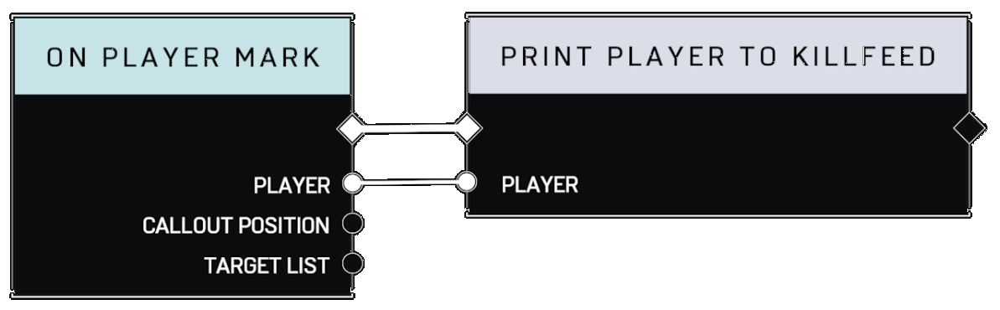
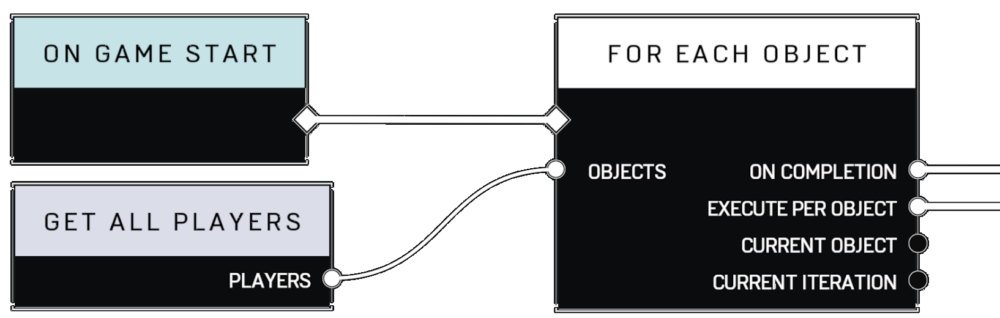

# Data Connection Pin

## Introduction

Data connection pins allow nodes to receive and provide data of one of the [Variable Types](../data-types/).

Input Pin

An input connection pin is used to receive data from another node.\
Some input connection pins do not have a corresponding node or Variable Type, rather - the node accepts input directly via it's Node Properties.

Output Pin

An output data connection pin, when connected to an input data connection pin on another node, will forward data for a given operation to that node.

May be connected to multiple [Execution ](../node-types/execution-node.md)and [Data ](../node-types/data-node/)nodes, can **not** be shared across [Event ](../node-types/event-node.md)nodes.




<figure><figcaption>
Above, the player is being received by the Print Player to Killfeed node from the On Player Mark Event.
</figcaption></figure>

 

<figure><figcaption>
Get All Players provides an Object List of Players when the For Each Object executes - at game start in this circumstance. Nodes will always provide the most current version of data that they provide via the data connection pin.
</figcaption></figure>




#### See Also
